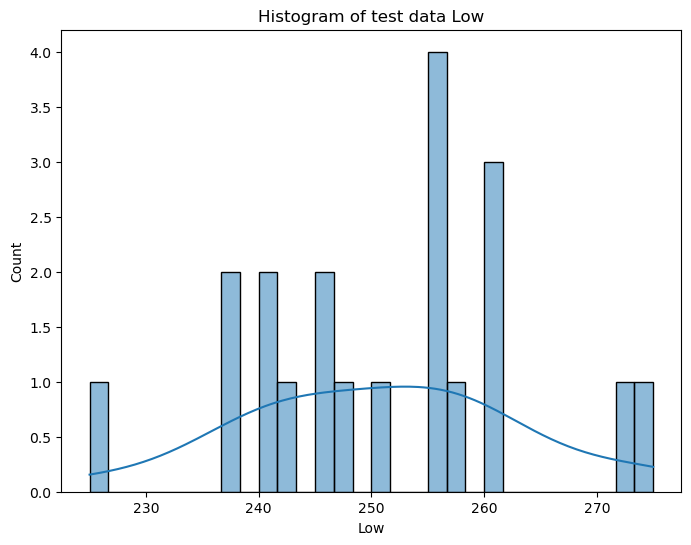
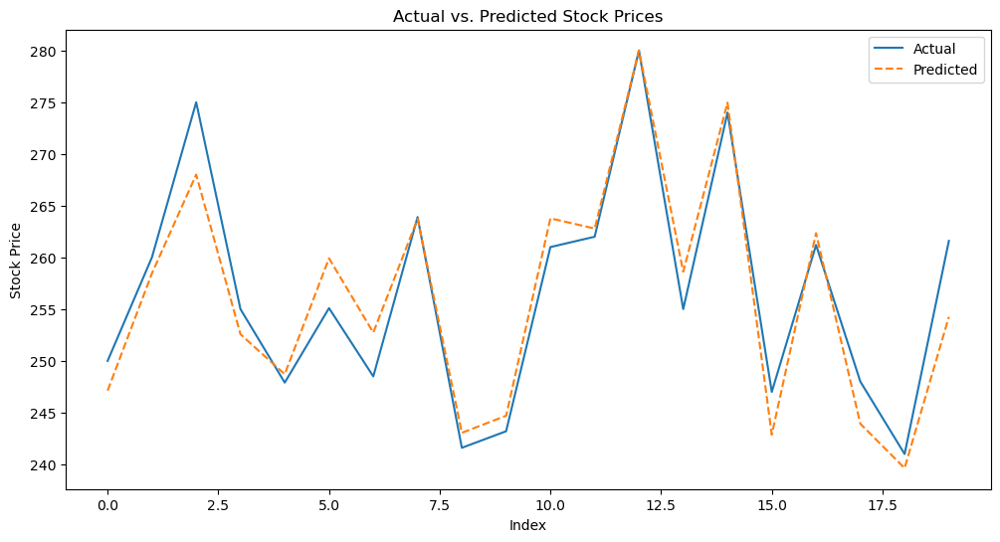
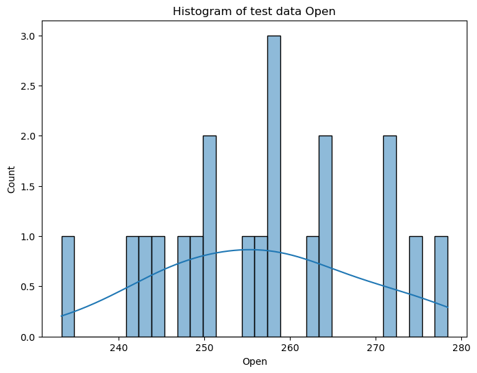
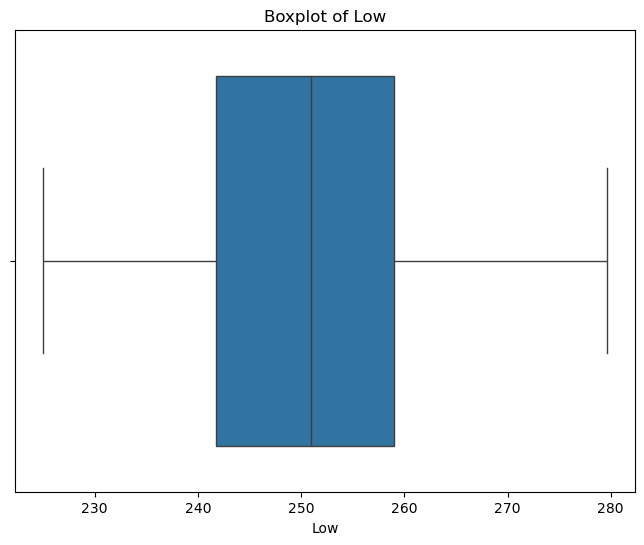
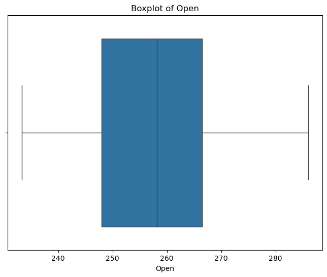
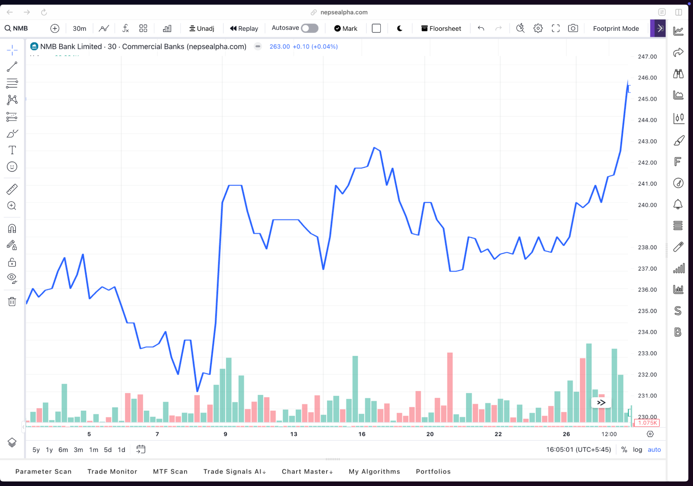
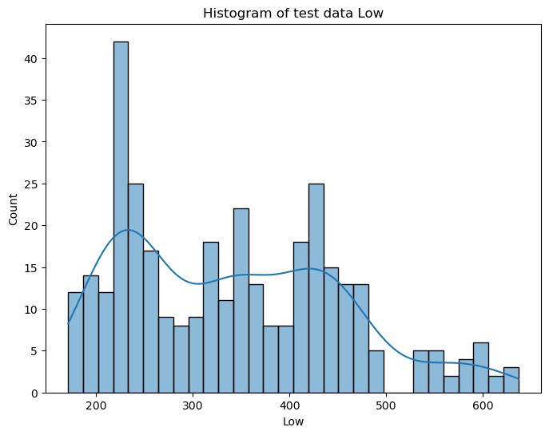
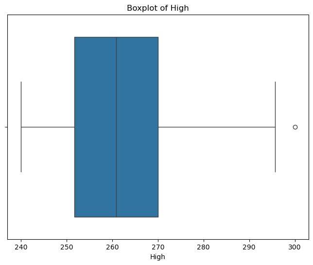
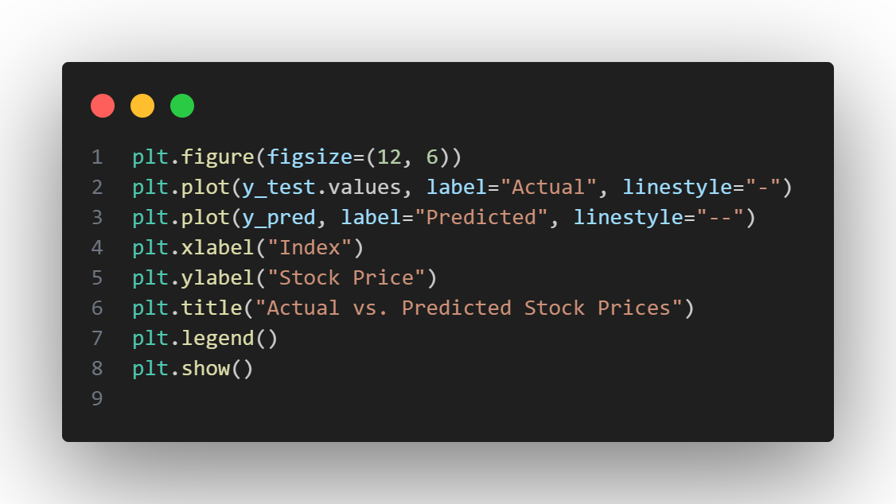

* "NMB BANK SHAREMARKET DATA ANALYSIS”
    * [Subject Code: DSMA 113]
    * Submission Date: 24/02/2025

## Acknowledgement

We extend our sincere gratitude to the Department of Mathematics for providing us the opportunity to conduct this project, “**NMB BANK SHAREMARKET DATA ANALYSIS**”. This project allowed us to explore the application of multivariate regression analysis in predicting stock market closing prices.

We are deeply thankful to **Assistant Prof. Narayan Sapkota**, our project supervisor, for his invaluable guidance, unwavering support, and insightful feedback throughout this project. His expertise significantly enhanced the quality of our work.

This project's success is attributed to the collective effort and dedication of our team members. We are grateful for their contributions and feel privileged to have collaborated with such inspiring individuals.

Lastly, we express our appreciation to our senior, **Ashim Shrestha**, for his valuable guidance and support.

## Table of Contents

1.  [Acknowledgement](#acknowledgement)
2.  [Introduction](#introduction)
3.  [Objective](#objective)
4.  [Motivation](#motivation)
5.  [Background Theory: Multivariate Linear Regression](#background-theory-multivariate-linear-regression)
6.  [Methodology](#methodology)
    * [1. Data Collection and Preprocessing](#data-collection-and-preprocessing)
    * [2. Feature Selection and Data Splitting](#feature-selection-and-data-splitting)
    * [3. Descriptive Analysis](#descriptive-analysis)
        * [Count](#count)
        * [Mean Values](#mean-values)
        * [Minimum and Maximum Values](#minimum-and-maximum-values)
        * [Percentile Distribution](#percentile-distribution)
        * [Standard Deviation](#standard-deviation)
    * [4. Exploratory Data Analysis (EDA)](#exploratory-data-analysis-eda)
        * [Box Plot](#box-plot)
        * [Histogram](#histogram)
        * [Q-Q Plot](#q-q-plot)
        * [Heatmap](#heatmap)
        * [Line Plot](#line-plot)
    * [5. Regression Analysis](#regression-analysis)
        * [Model Selection](#model-selection)
        * [Model Training and Prediction](#model-training-and-prediction)
        * [Model Evaluation](#model-evaluation)
    * [6. Comparison of Predicted and Actual Data Trends](#comparison-of-predicted-and-actual-data-trends)
7.  [Discussion](#discussion)
8.  [Conclusion](#conclusion)
9.  [Team](#team)

## Introduction

Multivariate Linear Regression (MLR) is a statistical method used to model the relationship between a dependent variable and multiple independent variables. In the context of stock market analysis, MLR helps understand how various factors influence stock prices.

This report applies MLR to the NMB Bank stock dataset to create a predictive model for stock price estimation. MLR is widely used in financial analytics for trend forecasting, risk assessment, and investment decision-making.

The analysis includes data preprocessing, model implementation, evaluation, and result interpretation. Using Python and its libraries, we efficiently analyze NMB’s stock data to extract meaningful insights.

The following sections detail dataset selection, preprocessing, model development, and performance evaluation, showcasing MLR's practical applications in stock market analysis.

## Objective

The primary objectives of this study are:

* To understand the fundamentals of Multivariate Linear Regression.
* To analyze historical stock market data using MLR.
* To build a predictive model for stock closing prices using multiple financial indicators.
* To evaluate model performance using statistical metrics such as Mean Absolute Error (MAE), Mean Squared Error (MSE), and R-squared (R²).
* To visualize actual vs. predicted stock prices and make future predictions.

## Motivation

The motivation behind this project is to address the dynamic nature of the stock market, which changes rapidly due to various global events. Accurate stock price prediction offers significant advantages to investors, traders, and financial institutions, enabling informed decisions and risk minimization.

While traditional stock analysis relies on fundamental and technical indicators, data-driven approaches using machine learning and statistical models offer new forecasting possibilities. Predicting the stock market requires rigorous analysis and continuous learning. We aim to identify patterns and develop informed strategies.

## Background Theory: Multivariate Linear Regression

Multivariate Linear Regression (MLR) models the relationship between multiple independent variables and a single dependent variable. It extends simple linear regression by incorporating multiple predictors.

**Y = β₀ + β₁X₁ + β₂X₂ + ... + βₙX<0xE2><0x82><0x99> + ε**

Where:

* **Y** is the dependent variable (target output).
* X₁, X₂, ..., X<0xE2><0x82><0x99> are the independent variables (predictors).
* β₀ is the intercept.
* β₁, β₂, ..., β<0xE2><0x82><0x99> are the coefficients.
* ε is the error term.

Assumptions of MLR:

1.  Linearity: Linear relationship between variables.
2.  Independence: Independent observations.
3.  No Multicollinearity: Independent variables should not be highly correlated.
4.  Homoscedasticity: Constant variance of residuals.
5.  Normality: Normally distributed residuals.

Model Evaluation Metrics:

* R-squared (R²): Explains variance in the dependent variable.
* Mean Squared Error (MSE): Average squared differences between actual and predicted values.
* Mean Absolute Error (MAE): Absolute differences between actual and predicted values.

MLR is used in finance, economics, healthcare, and marketing for predictive analysis. Python's sklearn library facilitates MLR implementation.

## Methodology

This section outlines the methodological approach, including Data Collection and Preprocessing, Exploratory Data Analysis (EDA), Descriptive Analysis, and Regression Analysis.

We used the following libraries:

### 1. Data Collection and Preprocessing

The dataset, "nmb_data.csv", was created from online resources. Data was loaded using Pandas. Preprocessing included converting the Date column to datetime format and handling missing values and outliers.

Loading Stock Data:

Datetime Conversion:

Numeric Conversion:

Handling Missing Values:

### 2. Feature Selection and Data Splitting

Relevant independent variables (X) were selected. The dataset was split into training and testing sets (80-20 ratio) using train_test_split from sklearn.model_selection.

Defining features and target variables.

### 3. Descriptive Analysis

Descriptive analysis using data.describe(include='all') provided key statistical insights:

* **Count:** 1,719 observations per variable.
* **Mean Values:**
    * Open Price: 257.98
    * High Price: 262.14
    * Low Price: 251.97
    * Close Price: 256.71
    * Trading Volume: 138,776.80
* **Minimum and Maximum Values:**
    * Lowest Open: 233.80, Highest Open: 286.00
    * Lowest Volume: 22,773, Highest Volume: 712,865
* **Percentile Distribution:**
    * 25% Open below 248.00, 75% below 266.50
    * Median Open: 258.00
* **Standard Deviation:**
    * Open: 12.53, High: 12.95, Low: 11.68, Close: 12.19
    * Trading Volume: 126,577.24

### 4. Exploratory Data Analysis (EDA)

EDA was conducted to understand the dataset's structure.

Code for BOX PLOT, HISTOGRAM and Q-Q PLOT

* **Box Plot:** Outlier detection and distribution analysis.
    
    
    
    
    
* **Histogram:** Frequency distribution.
    
    
    
